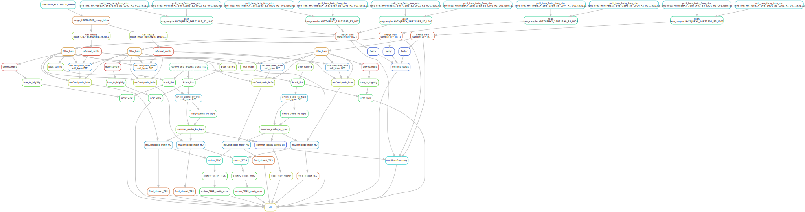

# ATAC of RPE

Hufnagel

Three cell line types:

1. iPSC derived from patient fibroblast
2. GFP+ RPE (believed to be functional RPE)
3. RFP+ RPE (unclear what kind of RPE this is)

Outputs:

1. MACS2 peak calling
2. msCentipede identification of TFBS of select TF
3. Downsampled bams converted to bigWig for UCSC
4. MACS2 peaks converted to bigBed to UCSC
5. Deeptools coverage across MACS2 peaks
6. FASTQC of bams
7. Reads per sample

