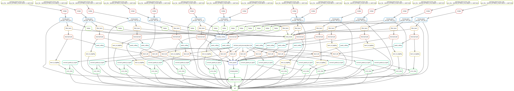

# Brief workflow

  1. bams realigned against GRCh37 + decoy with `bwa`
  2. Duplicate reads and reads with quality <5 removed
  3. Peaks called with `macs2 callpeak f BAM -g "hs" -t {input} -q 0.01 --keep-dup all --nomodel --extsize 200 --shift -100`
  4. Peaks for each sample merged into master peaks file
  5. Coverage for each sample calculated against master peaks file
  6. PCA done with coverage across master peaks file
  
# Direct Acyclic Graph of Workflow


```{r}
library(tidyverse)
library(data.table)
library(ggrepel)

cov <- fread('/Volumes/data/projects/nei/hufnagel/iPSC_RPE_ATAC_Seq/deeptools/multiBamSummary.tsv')
colnames(cov) <- gsub("\\'","",colnames(cov))

peak_pca <- prcomp(cov_cor[,4:length(cov_cor)] %>% t(), center = T, scale= T)

pca_plot <- peak_pca$x %>%  
  data.frame() %>% 
  rownames_to_column('Info') %>%
  rowwise() %>% 
  mutate(Sample = str_split(Info, '_')[[1]][1],
         Replicate = paste(str_split(Info, '_')[[1]][2],
                           str_split(Info, '_')[[1]][3], sep='_')) %>% 
  mutate(Replicate = gsub('.bam','', Replicate)) %>% 
  ggplot(aes(x=PC1, y=PC2, colour = Sample, label=Replicate)) + 
  geom_point() +
  geom_text_repel() +
  theme_minimal() +
  ggsci::scale_color_aaas()

stdev_plot <- peak_pca$sdev %>% 
  data.frame() %>% 
  ggplot(aes(y=., x=seq(1,12,by=1))) + 
  geom_bar(stat='identity') + 
  ylab('Standard Deviation') + 
  xlab('PC') + 
  theme_minimal() + 
  scale_x_continuous(breaks = seq(1,12,by=1))
```

# PCA
```{r}
pca_plot
```

# Standard Deviation oF PC
```{r}
stdev_plot
```

```{r}
# remove outliers
cov_cor2 <- cov_cor[,-c('iPSC_IIK_11.bam', 'RFP_IIG_3.bam')]
peak_pca <- prcomp(cov_cor2[,4:length(cov_cor2)] %>% t(), center = T, scale= T)


pca_plot <- peak_pca$x %>%  
  data.frame() %>% 
  rownames_to_column('Info') %>%
  rowwise() %>% 
  mutate(Sample = str_split(Info, '_')[[1]][1],
         Replicate = paste(str_split(Info, '_')[[1]][2],
                           str_split(Info, '_')[[1]][3], sep='_')) %>% 
  mutate(Replicate = gsub('.bam','', Replicate)) %>% 
  ggplot(aes(x=PC1, y=PC2, colour = Sample, label=Replicate)) + 
  geom_point() +
  geom_text_repel() +
  theme_minimal() +
  ggsci::scale_color_aaas()


stdev_plot <- peak_pca$sdev %>% 
  data.frame() %>% 
  ggplot(aes(y=., x=seq(1,10,by=1))) + 
  geom_bar(stat='identity') + 
  ylab('Standard Deviation') + 
  xlab('PC') + 
  theme_minimal() + 
  scale_x_continuous(breaks = seq(1,10,by=1))
```

# PCA, remove outliers
```{r}
pca_plot
```

# Standard Deviation oF PC, remove outliers
```{r}
stdev_plot
```